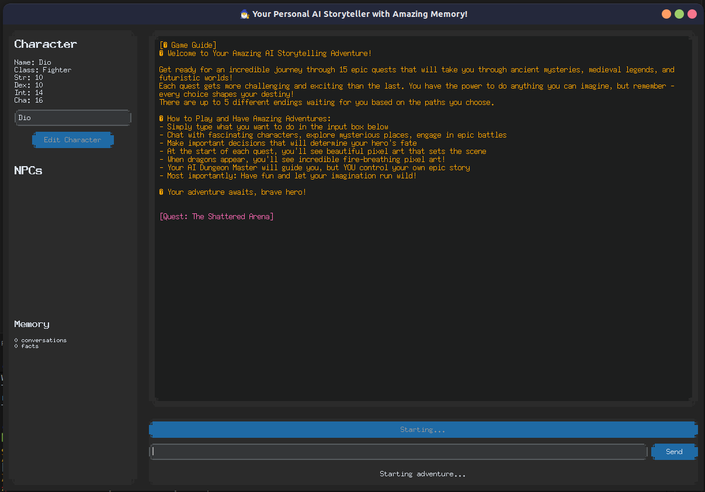
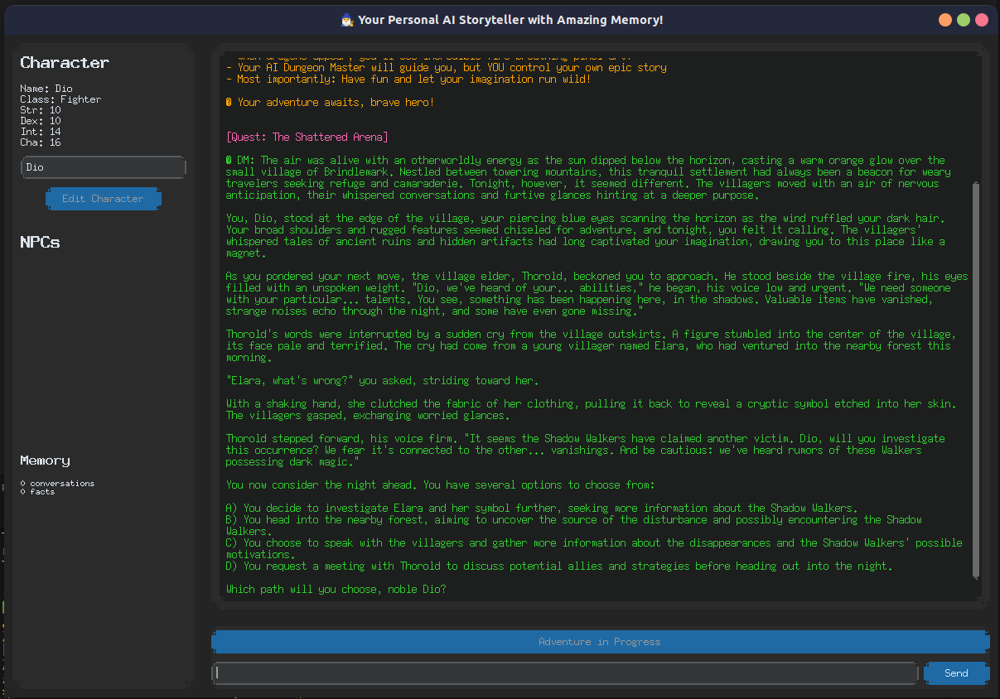
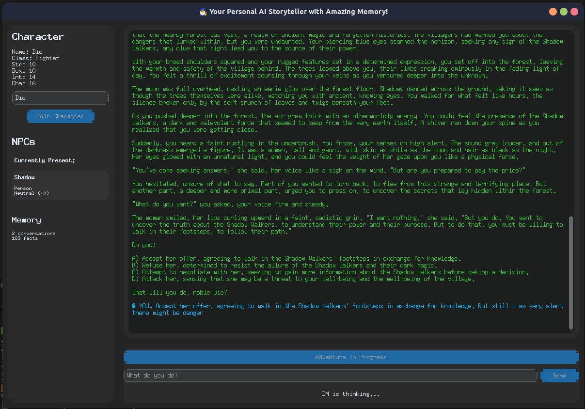

# 🎭 Welcome to LLM Storyteller! 🐉

✨ **Your Personal AI Dungeon Master Awaits!** ✨

Ever dreamed of having your very own Dungeon Master who never forgets a detail, creates amazing adventures on the fly, and brings NPCs to life with realistic emotions? Well, dream no more! 🌟

This magical application is like having a brilliant storyteller living in your computer - one who uses cutting-edge AI to weave incredible tales just for you. Whether you're a seasoned adventurer or completely new to storytelling games, this friendly AI will guide you through unforgettable journeys! 🗺️

## 📸 **See the Magic in Action!** ✨

<div align="center">

### 🎮 **Beautiful GUI Interface**

*Experience storytelling through our gorgeous, modern interface with character tracking and immersive chat!*

### 🧠 **Memory System in Action** 

*Watch as our legendary memory palace remembers every detail of your adventure!*

### 🎭 **Character & NPC Management**

*Create amazing characters and watch NPCs come to life with real emotions and relationships!*

</div>

## 🎬 **Watch the Demo Video!**

[](demo/Video/Video1.mp4)

*See LLM Storyteller in action with a full walkthrough of the magical interface and features!* 

---

## 🌟 What Makes This Adventure Special?

🎨 **Beautiful & Intuitive Interface**: A gorgeous, modern design that feels like stepping into a fantasy tavern! Built with love using customtkinter, featuring a cozy chat window and a magical sidebar that shows your character's journey.

🧙‍♂️ **Your AI Dungeon Master**: Powered by incredibly smart AI (Groq's llama-3.1-8b-instant) that creates stories so engaging, you'll forget you're talking to a computer! Every response is crafted just for your unique adventure.

🧠 **Never-Forget Memory System** (The Secret Sauce!):
    * 💭 **Recent Memory**: Keeps track of what just happened - like a sharp-eyed adventurer!
    * 🎬 **Scene Memory**: Automatically notices when scenes change and remembers the important bits
    * 🏛️ **Legendary Memory**: Like an ancient library, it remembers EVERYTHING important from your entire journey - no detail is ever truly lost!

💝 **Living, Breathing NPCs**: Every character you meet has real emotions and remembers how you treat them! Be kind to the tavern keeper, and they might give you a discount. Cross a merchant, and word might spread... The AI even notices when new characters appear and starts caring about them too!

⚔️ **Simple Yet Engaging Adventures**: No complicated dice rolls or confusing stats - just pure storytelling magic! Your character can be Healthy or Wounded, and quests unfold naturally through the power of narrative.

## 📋 What You'll Need for This Adventure

🐍 **Python 3.10 or newer** - Don't worry, it's free and easy to install!
📦 **A few magical dependencies** - We've made it super simple with our `requirements.txt` spell book:
    * `groq` - The brain that powers your AI Dungeon Master
    * `python-dotenv` - Keeps your API key safe and sound
    * `customtkinter` - Makes everything look absolutely gorgeous
    * `networkx` - Helps track relationships between characters
    * `sentence-transformers` - The secret sauce for understanding context

## 🚀 Ready to Start Your First Adventure?

Don't worry - we'll guide you through every step! Even if you've never used Python before, you'll be adventuring in no time! 🎉

### Step 1: 🏠 Set up your adventure headquarters
This creates a cozy little space just for your storytelling app:
```bash
python -m venv venv
source venv/bin/activate  # On Windows, use: venv\Scripts\activate
```

### Step 2: 📚 Gather your magical components
This installs all the special ingredients needed for the magic to work:
```bash
pip install -r requirements.txt
```

### Step 3: 🗝️ Get your secret key
Create a special file called `.env` in your project folder and add your Groq API key (don't worry, we'll help you get one!):
```text
GROQ_API_KEY=your_groq_api_key_here
```
💡 **Pro tip**: You can get a free Groq API key from https://groq.com - it's quick and totally free!

### Step 4: 🎪 Let the adventure begin!
```bash
python main.py
```
🎉 **That's it!** Your personal AI Dungeon Master is now ready to create amazing stories with you!

## 🧪 Testing the Magic (For the Curious Adventurers!)

We've built some really cool tests to make sure everything works perfectly! Think of these as quality assurance spells that verify our AI Dungeon Master is working at peak performance! 🎯

Our test suite is like a comprehensive adventure journal that checks:
- 🧠 **Memory Magic**: Including legendary "needle in haystack" tests where we hide important details in long stories to see if the AI remembers them!
- 😊 **NPC Heart & Soul**: Making sure every character's emotions and relationships feel real and consistent
- 📖 **Story Weaving**: Ensuring your adventures flow naturally and characters stay true to themselves  
- ⚡ **Lightning-Fast Performance**: Keeping response times snappy so the magic never breaks

### 🎭 Test All the Magic at Once
```bash
source venv/bin/activate
python run_tests.py all
```

### 🎯 Focus on Specific Enchantments
```bash
python run_tests.py memory      # Test the legendary memory system
python run_tests.py npc         # Check NPC emotions and relationships  
python run_tests.py story       # Verify story consistency magic
python run_tests.py performance # Ensure everything runs like lightning
```

📚 **Want the full testing spellbook?** Check out `tests/README.md` for all the magical details!

## 🗺️ Your Adventure Map (Project Structure)

Here's where all the magic lives! Don't worry about understanding every detail - this is more like a treasure map for fellow adventurers who want to peek under the hood! 🔍

* 🎪 `main.py`: Your gateway to adventure! This is where the magic begins when you start the app.
* 🏰 `storyteller/`: The grand castle where all the storytelling magic happens:
    * 🧠 `core/`: The brain center of our AI Dungeon Master
        * `engine.py`: The master conductor orchestrating your entire adventure
        * `character.py`: Your personal character workshop and memory keeper
        * `memory.py`: The legendary three-tier memory palace (our secret sauce!)
        * `npc.py`: Where every NPC gets their heart, soul, and emotional intelligence
    * 🎨 `ui/`: The beautiful face of your adventure
        * `gui.py`: Your gorgeous CustomTkinter interface with magical sidebars
    * 🛠️ `utils/`: The helpful toolkit
        * `llm.py`: The bridge to your AI Dungeon Master's brilliant mind
    * ⚙️ `config.py`: All the settings and magical configurations
* 🧪 `tests/`: Our quality assurance laboratory (where we make sure the magic never breaks!)
    * `test_memory.py`: Legendary memory tests including the famous needle-in-haystack challenges
    * `test_npc_emotions.py`: Making sure every NPC's heart beats true
    * `test_story_consistency.py`: Ensuring your stories flow like epic novels
    * `test_performance.py`: Keeping everything lightning-fast and responsive
    * `run_all_tests.py`: The grand test conductor
* 🎯 `run_tests.py`: Your friendly test launcher (makes testing magical and simple!)

## 📜 Legal Scroll (License)

This entire magical kingdom is shared under the MIT License! That means you're free to use it, share it, modify it, and even build your own storytelling empire on top of it! Check out the `LICENSE` file for all the official details. 🤝✨